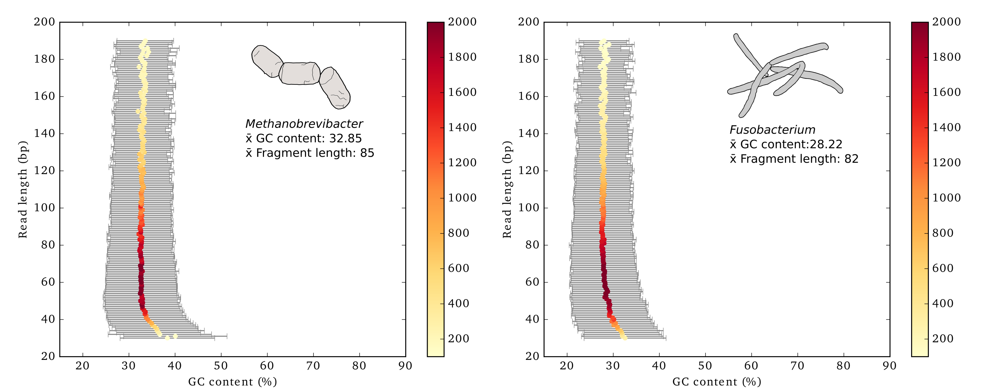

# GC content and length correlation plots

[](https://zenodo.org/badge/latestdoi/74466977)

This script calculates summary statistics for read length and GC content from a fasta or fastq file and generates a statistics table and plot. Written for the dental calculus versus dentin project: [Mann AE, Sabin S, Ziesemer KA, Vågene Å, Schroeder H, Ozga A, Sankaranarayanan K, Hofman CA, Fellows-Yates J, Salazar Garcia D, Frohlich B, Aldenderfer M, Hoogland M, Read C, Krause J, Hofman C, Bos K, Warinner C. (2018) Differential preservation of endogenous human and microbial DNA in dental calculus and dentin. Scientific Reports 8:9822.](https://www.nature.com/articles/s41598-018-28091-9)



GC content and length correlation plots is written with python 3+ and relies on the following packages:

* [BioPython](https://biopython.org/) 
* [Matplotlib](https://matplotlib.org/)
* [Pandas](https://pandas.pydata.org/)
* [Numpy](http://www.numpy.org/)
* [Scipy](https://www.scipy.org/)

### Examples
Generate a plot showing the mean GC content for each lenth bin
```
gcLenCorPlots.py -i mytaxa.fa 
```

Generate a plot showing the median GC content for each length bin and normalizing the input data to 2,000 reads
```
gcLenCorPlots.py -i mytaxa.fa -m median -s 2000
```

Generate a plot showing the mean GC content for each length bin normalizing the input data to 100 reads, and only considering those reads that are less than 200 bases long
```
gcLenCorPlots.py -i mytaxa.fa -m median -s 100 -t 200
```

Generate a plot showing the mean GC content for each length bin setting the range of the color scale to represent the maximum and minimum read counts and setting the error bar color to blue
```
gcLenCorPlots.py -i mytaxa.fa -r max -ec blue
```

Help and additional parameter descriptions
```
gcLenCorPlots.py -h
```


